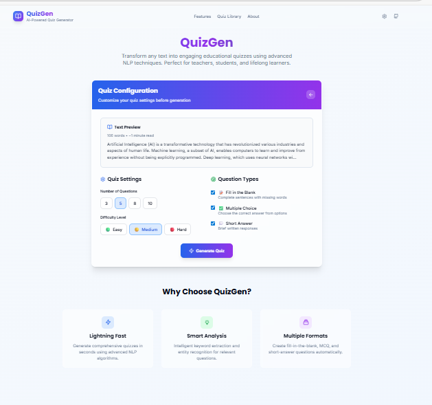
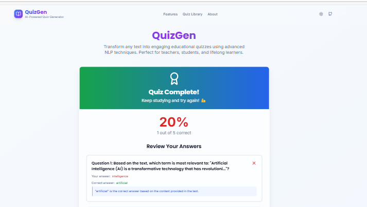

# QuizGen 🧠✨

**QuizGen** is an NLP-based quiz generation project that allows users to automatically generate quizzes from text input or uploaded files. It provides an interactive quiz experience with configurable question types, difficulty levels, and instant result evaluation.

---

## 🚀 Features

### 📥 Input Methods
- Upload files  
- Paste your own paragraph/text  
- Use sample data paragraph  

### ⚙️ Quiz Generation Settings
- Select **type of questions** (e.g., MCQs, blanks, short answer etc.)  
- Choose **difficulty level** (Easy / Medium / Hard)  
- Select **number of questions**  

### 📝 Quiz Interaction
- Quiz appears instantly after generation  
- Solve quiz directly on the platform  
- Submit quiz for evaluation  

### 📊 Results
- Instant score display  
- Correct answers shown below each question  

### 🔁 Options
- **Start Over** – Restart quiz generation  
- **Save** – (UI present, feature under development)  
- **Share** – (UI present, feature under development)  

---

## 📁 Project Workflow

1. Upload `.txt` file OR paste text OR select sample data  
2. Click **Generate Quiz**  
3. Choose:
   - Question type  
   - Difficulty level  
   - Number of questions  
4. Quiz is generated  
5. Solve the quiz  
6. Submit quiz  
7. View:
   - Score  
   - Correct answers  
8. Options:
   - Start Over  
   - Save (Coming Soon)  
   - Share (Coming Soon)  

---

## 📸 Project Screenshots

  
  
  
  
  
  

---

## 🔧 Installation & Setup

```bash
# Clone repository
git clone https://github.com/your-username/quizgen.git
